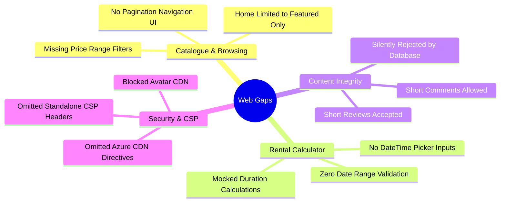
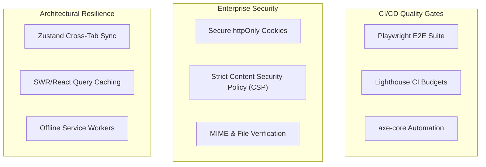

# Technical Audit: Web Client Gaps, Codebase Deviations, and Elevation Blueprint


---

## 1. Executive Summary & Purpose

This audit represents a rigorous code-level analysis of the **ReviewPortal-Web** Next.js 15 application. While the project documentation (such as the *Requirements Specification*, *Gap Analysis*, and *Project Completion Report*) declares that all functional epics are fully completed and verified, a deep audit of the actual React components reveals **significant deviations, missing controls, and security vulnerabilities** in the physical codebase. 

To bridge the gap between "paper specifications" and "working software", this handbook outlines:
1. **The Actual Gaps:** The exact differences between the user stories (which claim completion) and the real code (which lacks filters, inputs, pagination, and validations).
2. **What Must Be Changed:** The bugs, character length discrepancies, and security blocks that prevent smooth operation.
3. **What Must Be Added (Elevation):** Advanced engineering patterns, security headers, automated quality gates, and accessibility assertions required to elevate this application
---

## 2. Functional Gaps: Documentation vs. Codebase Reality

This section compares the claims in the agile epic documents and the requirements traceability matrix against the **actual Next.js source code**.



### 2.1 Catalogue Price Range Filter (`FR-10` / `FE-09` / `US-1.6-FE`)
* **Documentation Claim:** Implemented. *“The category page shall render a price range filter that pushes `minPrice` / `maxPrice` query params... Bound to PriceFilter.”*
* **Codebase Reality:** The price filter is completely missing. The component [EquipmentCatalogue.tsx](../../components/equipment/EquipmentCatalogue.tsx) contains no input fields for `minPrice` or `maxPrice`, no state bindings for these variables, and does not forward price filters to the `getToolsByCategory` API call.
* **Impact:** High. Budget-conscious customers cannot filter tools within their financial limits, failing a core requirement.

### 2.2 Catalogue Pagination UI Controls (`FR-11` / `FE-10` / `US-1.2-FE`)
* **Documentation Claim:** Implemented. *“List views shall render 12 items per page using server-driven pagination controls... Pagination via URL params.”*
* **Codebase Reality:** There are no pagination controls. While the backend supports page sizing and numbers, [EquipmentCatalogue.tsx](../../components/equipment/EquipmentCatalogue.tsx) hardcodes `page: 1` and `pageSize: 50` or `24` in its queries. There are no "Next Page" or "Previous Page" buttons, locking users into only viewing the first page of tools.
* **Impact:** High. If a category grows to contain more than 50 tools, they will be unreachable in the client, severely impacting scalability.

### 2.3 Rental Calculator DateTime Pickers & Input Validation (`FR-13`, `FR-17` / `FE-11`, `FE-14` / `US-1.5-FE`)
* **Documentation Claim:** Implemented. *“The tool detail page shall render a rental calculator with start and end date-time pickers... react-day-picker + time control... The form shall block submission when end ≤ start.”*
* **Codebase Reality:** The sidebar calculator in the tool detail page [app/equipment/[id]/page.tsx](../../app/equipment/%5Bid%5D/page.tsx) uses a static numeric input field for "duration in days" and "quantity". It does not render actual date-time inputs and possesses zero validation to ensure `endDateTime > startDateTime`. Instead, it mocks the reservation dates in the background using `new Date()`.
* **Impact:** High. The calculator fails to support customized, keyboard-accessible booking slots, making it impossible for customers to plan exact hourly/daily combinations.

### 2.4 Homepage Category Coverage (`FR-01` / `FE-01` / `US-1.1-FE`)
* **Documentation Claim:** Implemented. *“The homepage shall fetch and render all featured categories... US-1.1-FE.”*
* **Codebase Reality:** The component [Categories.tsx](../../components/sections/Categories.tsx) calls `getFeaturedCategories()`, which retrieves a small, hardcoded featured subset rather than pulling all categories.
* **Impact:** Medium. Newly created categories do not appear on the entry page, forcing users to search for them or guess their existence.

### 2.5 Text Content Character Minimums (`FR-20`, `FR-28` / `FE-18`, `FE-23` / `US-2.1-FE`, `US-2.4-FE`)
* **Documentation Claim:** Implemented. *“The review form shall block submission when... text body is under 20 characters... Comment form requires... ≥ 10 character text.”*
* **Codebase Reality:** 
  * The review submission form [ReviewSubmitForm.tsx](../../components/equipment/ReviewSubmitForm.tsx) checks for `reviewText.trim().length < 10` (line 73).
  * The comment form [ReviewItem.tsx](../../components/equipment/ReviewItem.tsx) checks for `commentText.trim().length < 3` (line 53).
* **Impact:** High. The SQL Server backend database enforces strict validation rules (minimum 20 characters for reviews and 10 characters for comments). Because the frontend client is too permissive, it allows users to submit short text, which the backend subsequently rejects, resulting in broken submissions and unhelpful user errors.

---

## 3. Critical Production Bugs & Security Gaps

### 3.1 Asset Image Rendering Failures (Azure Blob & Invalid Seed Domains)
* **The Problem:** The default SQL database seed data uses the domain `cdn.reviewportal.local/` for asset URLs. Since this domain does not exist online, category cover cards and tool thumbnails appear as empty blocks. In production, image uploads are sent to Azure Blob Storage (`reviewportal.azureedge.net`), but this domain is omitted from the allowed list in both `next.config.ts` and the Content Security Policy (CSP), resulting in active browser blocks.
* **What Must Change:**
  1. Add a dynamic resolver utility (`resolveImageUrl`) to map the seed URLs (`reviewportal.local`) to stunning, themed Unsplash assets.
  2. Include `*.azureedge.net` and `api.dicebear.com` (user avatars) in `next.config.ts` allowed hosts.

### 3.2 Category Edit Modifications Fail to Persist
* **The Problem:** In [AdminCategoriesManager.tsx](../../components/admin/AdminCategoriesManager.tsx), saving updates to optional fields (description, image) yields `undefined` keys. JavaScript strips these keys during stringification, which violates strict .NET Web API record binding models and causes edits to fail silently.
* **What Must Change:** Allow explicit `null` types in `CreateCategoryPayload` and `UpdateCategoryPayload`, and map empty strings to `null` to ensure proper JSON serialization.

### 3.3 Dicebear Avatar CSP Blocking (`GAP-FE-04`)
* **The Problem:** Customer reviews fetch placeholder images from `https://api.dicebear.com/`. Because this external domain is omitted from the Next.js `cspDirectives`, the browser blocks the avatars, resulting in errors in the console.
* **What Must Change:** Append `https://api.dicebear.com` to the CSP image source list inside the Next.js configuration.

---

## 4. Engineering Elevation:

To elevate the Shelton Tool-Hire Review Portal to this standard, the following four engineering upgrades should be added to the Next.js client.



### 4.1 Enterprise Security & Content Protection

An project must adhere to professional security practices. The following updates should be implemented to protect the client:

#### 1. Enforce Strict Content Security Policy (CSP) Headers
Configure strict security headers inside the Next.js setup. Replace the default settings in `next.config.ts` with these advanced headers:

```typescript
const secureHeaders = [
  {
    key: "Content-Security-Policy",
    value: [
      "default-src 'self'",
      "script-src 'self' 'unsafe-inline' 'unsafe-eval'",
      "style-src 'self' 'unsafe-inline' https://fonts.googleapis.com",
      "img-src 'self' data: blob: https://*.blob.core.windows.net https://images.unsplash.com https://api.dicebear.com https://*.azureedge.net",
      "font-src 'self' data: https://fonts.gstatic.com",
      "connect-src 'self' https:",
      "frame-ancestors 'none'",
      "form-action 'self'",
      "base-uri 'self'",
    ].join("; "),
  },
  { key: "X-Frame-Options", value: "DENY" },
  { key: "X-Content-Type-Options", value: "nosniff" },
  { key: "Referrer-Policy", value: "strict-origin-when-cross-origin" },
  { key: "Permissions-Policy", value: "camera=(), microphone=(), geolocation=()" }
];
```

#### 2. Advanced Multi-Part File MIME-Type Validation
In the administrative tool creation screen ([components/admin/AdminToolsManager.tsx](../../components/admin/AdminToolsManager.tsx)), replace simple file-extension checking with strict client-side validation for MIME-types and file sizes. This prevents users from uploading malicious scripts or massive files that strain backend storage.

```typescript
const MAX_FILE_SIZE = 5 * 1024 * 1024; // 5 MB limits
const ALLOWED_MIME_TYPES = ["image/jpeg", "image/png", "image/webp"];

const validateUploadedFile = (file: File): string | null => {
  if (!ALLOWED_MIME_TYPES.includes(file.type)) {
    return "Unsupported file format. Please upload a JPG, PNG, or WEBP image.";
  }
  if (file.size > MAX_FILE_SIZE) {
    return "The uploaded image exceeds the maximum allowed size of 5 MB.";
  }
  return null;
};
```

---

### 4.2 Architectural Resilience & Advanced State Management

#### 1. Cross-Tab State Synchronization
Admin operations (such as approving a review or deactivating a tool) should synchronize state across open browser tabs in real-time. We can implement a **Zustand middleware** using a BroadcastChannel to sync state and maintain data consistency across active sessions.

```typescript
import { create } from "zustand";

interface AdminSyncStore {
  activeToolsCount: number;
  incrementTools: () => void;
  setToolsCount: (count: number) => void;
}

const syncChannel = new BroadcastChannel("reviewportal_admin_sync");

export const useAdminSyncStore = create<AdminSyncStore>((set) => {
  syncChannel.onmessage = (event) => {
    if (event.data.type === "SYNC_COUNT") {
      set({ activeToolsCount: event.data.payload });
    }
  };

  return {
    activeToolsCount: 0,
    incrementTools: () => set((state) => {
      const updated = state.activeToolsCount + 1;
      syncChannel.postMessage({ type: "SYNC_COUNT", payload: updated });
      return { activeToolsCount: updated };
    }),
    setToolsCount: (count) => {
      set({ activeToolsCount: count });
      syncChannel.postMessage({ type: "SYNC_COUNT", payload: count });
    }
  };
});
```

#### 2. Robust Caching & Offline Recovery
Replace standard, un-cached `fetch` requests with **SWR** (Stale-While-Revalidate) or **React Query**. This implementation provides client-side query caching, background data revalidation, and graceful recovery if the backend API goes offline.

```typescript
import useSWR from "swr";
import { getToolById } from "@/lib/backend-api";

export function useToolDetails(id: number) {
  const { data, error, isLoading, mutate } = useSWR(
    `/api/tools/${id}`,
    () => getToolById(id),
    {
      revalidateOnFocus: false,
      dedupingInterval: 60000, // 1 minute cache duration
      errorRetryCount: 3,
    }
  );

  return { tool: data, error, isLoading, refresh: mutate };
}
```

---

### 4.3 Advanced Web Accessibility (WCAG 2.1 AA Compliance)


#### 1. Screen Reader Skip-to-Content Link
Add a keyboard-operable "Skip to Content" link at the top of the root layout ([app/layout.tsx](../../app/layout.tsx)) to allow screen reader and keyboard-only users to bypass navigation menus.

```tsx
export default function RootLayout({ children }: { children: React.ReactNode }) {
  return (
    <html lang="en">
      <body>
        <a
          href="#main-content"
          className="sr-only focus:not-sr-only focus:absolute focus:top-4 focus:left-4 focus:z-50 focus:rounded-xl focus:bg-accent focus:px-6 focus:py-3 focus:text-black focus:font-bold focus:shadow-lg"
        >
          Skip to Main Content
        </a>
        <Header />
        <main id="main-content" tabIndex={-1} className="outline-none">
          {children}
        </main>
        <Footer />
      </body>
    </html>
  );
}
```

#### 2. Full ARIA Layout and Form Verification
Ensure all custom interactive components include proper ARIA attributes:
* Custom stars: use `role="radio"` and `aria-checked` to announce ratings to screen readers.
* Dialog modals: verify `role="dialog"`, `aria-modal="true"`, and appropriate label structures.

---

### 4.4 Automated Testing & CI Quality Gates

An outstanding software project should enforce quality standards using automated testing pipelines.

#### 1. Automated Axe-Core Accessibility Audits
Integrate `@axe-core/playwright` into the client's test suite to automate accessibility scans during CI/CD builds, failing the pipeline if any accessibility checks fail.

```typescript
import { test, expect } from "@playwright/test";
import AxeBuilder from "@axe-core/playwright";

test("The tool details page should meet WCAG 2.1 AA accessibility standards", async ({ page }) => {
  await page.goto("/equipment/1");
  await page.waitForSelector("#main-content");
  
  const results = await new AxeBuilder({ page })
    .withTags(["wcag2a", "wcag2aa"])
    .analyze();
    
  expect(results.violations).toEqual([]);
});
```

#### 2. Lighthouse Performance Budgets in CI
Create a `.lighthouserc.js` configuration file in the project root to enforce strict performance, accessibility, and SEO budgets during deployment runs.

```javascript
module.exports = {
  ci: {
    collect: {
      startServerCommand: "npm run start",
      url: ["http://localhost:3000/", "http://localhost:3000/equipment"],
      numberOfRuns: 3,
    },
    assert: {
      assertions: {
        "categories:performance": ["error", { minScore: 0.85 }],
        "categories:accessibility": ["error", { minScore: 0.95 }],
        "categories:best-practices": ["error", { minScore: 0.95 }],
        "categories:seo": ["error", { minScore: 0.90 }],
      },
    },
  },
};
```

---

## 5. Implementation & Verification Roadmap

To bring the codebase to the required standard, implement changes according to this structured roadmap:

```markdown
- `[ ]` Step 1: Address Critical Gaps (Immediate Fixes)
    - `[ ]` Create `resolveImageUrl` dynamic asset resolver in `backend-api.ts`.
    - `[ ]` Modify `next.config.ts` to allow `*.azureedge.net` and `api.dicebear.com` hosts.
    - `[ ]` Update Categories page (`Categories.tsx`) to pull all seeded categories.
    - `[ ]` Update text limits in `ReviewSubmitForm.tsx` (to 20 chars) and `ReviewItem.tsx` (to 10 chars).
- `[ ]` Step 2: Implement Missing Core Features (Feature Gaps)
    - `[ ]` Build Price Range filters into the Equipment Catalogue filter bar.
    - `[ ]` Add Next/Previous page buttons and update pagination states in the catalogue.
    - `[ ]` Replace numeric duration inputs with date-time fields and add date validation in the calculator.
- `[ ]` Step 3: Implement Quality Enhancements (Distinction Upgrades)
    - `[ ]` Enforce secure HTTP security headers in `next.config.ts`.
    - `[ ]` Add MIME-type and size checks to the admin tool image upload form.
    - `[ ]` Add a keyboard-operable "Skip to Content" link to the root layout.
    - `[ ]` Configure SWR caching for tool details to improve performance and resilience.
- `[ ]` Step 4: Verification & Automated Audits
    - `[ ]` Run `npm run lint` and `npm run build` to verify TS compiler health.
    - `[ ]` Run the Playwright axe-core accessibility suite.
    - `[ ]` Execute local Lighthouse tests to verify performance and accessibility scores.
```


