# Component & Module Design — Shelton Tool-Hire Review Portal (Web Client)

> Purpose: MSc submission design artefact for the Next.js web client.
>
> Equivalent of the API's [DATABASE-DESIGN.md](../../ReviewPortal-API/docs/DATABASE-DESIGN.md). Where the backend doc catalogues persistent tables, this doc catalogues the route tree, component layers, modules, and the contracts between them.
>
> Frontend platform: Next.js 15 App Router on React 19 and TypeScript 5.

---

## 1. Design Overview

The web client is a thin presentation layer over the ASP.NET Core API. It owns:

- the public catalogue, calculator, and review flows
- the customer account screens
- the back-office shell for admin/moderator workflows
- client-side form validation, navigation, accessibility, and JWT cookie handling

It does **not** own any persistent data. All durable state lives in SQL Server behind the API. The only client-side state is ephemeral UI state held in Zustand and React component state.

---

## 2. Naming and Layering Conventions

| Layer | Location | Purpose |
|-------|----------|---------|
| Route segments | [app/](../app/) | URL surface, layouts, route handlers, server components |
| UI primitives | [components/ui/](../components/ui/) | Generic shadcn/ui primitives — no business logic |
| Feature components | [components/equipment](../components/equipment), [components/feed](../components/feed), [components/account](../components/account), [components/admin](../components/admin), [components/layout](../components/layout), [components/sections](../components/sections) | Domain-aware compositions of UI primitives |
| Server data access | [lib/server-api.ts](../lib/server-api.ts), [lib/backend-api.ts](../lib/backend-api.ts) | Server-only `fetch` wrappers, cookie handling |
| Client data access | [lib/api-client.ts](../lib/api-client.ts) | Browser `fetch` against the internal `/api/backend/*` proxy |
| Guards | [lib/admin-guard.ts](../lib/admin-guard.ts) | Auth/role gating run before admin pages render |
| Hooks | [hooks/](../hooks/) | Reusable client hooks (`useCurrentUser`, `useDebounce`) |
| Stores | [store/](../store/) | Zustand stores for ephemeral client state |
| Types | [types/api.ts](../types/api.ts) | Single source of truth for API DTO shapes |
| Static data | [lib/equipment-data.ts](../lib/equipment-data.ts) | Static fallback / seed data for local mock rendering |

Rules:
- Server-only modules must not be imported from a Client Component.
- Feature components must not import directly from other feature folders — they go through `lib/` or shared UI primitives.
- DTO types in `types/api.ts` are read-only contracts; components must not mutate them.

---

## 3. Route Catalogue

The App Router file system in [app/](../app/) defines the route tree.

| Route | File | Render Mode | Purpose |
|-------|------|-------------|---------|
| `/` | [app/page.tsx](../app/page.tsx) | RSC + ISR | Homepage with featured categories and hero sections |
| `/equipment` | [app/equipment/page.tsx](../app/equipment/page.tsx) | RSC + ISR | All categories overview |
| `/equipment/[categoryId]` | [app/equipment/[categoryId]/page.tsx](../app/equipment/) | RSC + ISR | Category browse with sort, filter, pagination |
| `/equipment/[categoryId]/[toolId]` | nested route | RSC | Tool detail page with calculator and review feed |
| `/services` | [app/services/](../app/services/) | RSC | Services category shortcut |
| `/pricing` | [app/pricing/](../app/pricing/) | RSC | Marketing content |
| `/contact` | [app/contact/](../app/contact/) | RSC | Contact form |
| `/login`, `/register`, `/forgot-password`, `/reset-password` | [app/login](../app/login), [app/register](../app/register), [app/forgot-password](../app/forgot-password), [app/reset-password](../app/reset-password) | Client | Auth flows |
| `/account/...` | [app/account/](../app/account/) | RSC + Client | My profile, my reviews, change password |
| `/reviews/...` | [app/reviews/](../app/reviews/) | RSC | Review threads, comment view |
| `/admin/...` | [app/admin/](../app/admin/) | RSC + Client (guarded) | Back-office shell, tools, categories, moderation, dashboard |
| `/api/auth/login` | [app/api/auth/login/route.ts](../app/api/auth/login/) | Route handler | Forwards to backend `/api/auth/login`, sets httpOnly cookie |
| `/api/auth/logout` | [app/api/auth/logout/route.ts](../app/api/auth/logout/) | Route handler | Clears the auth cookie |
| `/api/auth/me` | [app/api/auth/me/route.ts](../app/api/auth/me/) | Route handler | Reads cookie and returns current user |
| `/api/backend/[...path]` | [app/api/backend/[...path]/route.ts](../app/api/backend/) | Route handler | Proxies arbitrary backend calls, attaches the JWT cookie |

---

## 4. Component Catalogue

### 4.1 Layout (`components/layout/`)

| Component | Purpose |
|-----------|---------|
| `SiteHeader` | Top nav, logo, search bar, account menu — visible on every public page |
| `SiteFooter` | Standard footer with legal/contact links |
| `MobileNav` | Sheet-based mobile menu using Radix Dialog |
| `Container` | Width-constrained layout wrapper used by route pages |

### 4.2 Public Sections (`components/sections/`)

| Component | Purpose |
|-----------|---------|
| `HeroSection` | Homepage hero with CTA |
| `FeaturedCategories` | Category cards on the homepage |
| `RecentReviewsSection` | Approved reviews preview |
| `CtaSection` | Marketing call-to-action band |

### 4.3 Equipment (`components/equipment/`)

| Component | Purpose |
|-----------|---------|
| `CategoryCard` | Card representation of a category |
| `ToolCard` | Card representation of a tool with rating summary |
| `ToolGrid` | Paginated grid of `ToolCard` |
| `SortControls` | Sort dropdown bound to URL params |
| `PriceFilter` | Min/max price range bound to URL params |
| `ToolGallery` | Image carousel for the detail page |
| `RentalCalculator` | Date range form + POST to `/api/tools/{id}/rental-calculation` + breakdown render |
| `RateTable` | Hourly / daily / weekly rate table |

### 4.4 Feed (`components/feed/`)

| Component | Purpose |
|-----------|---------|
| `ReviewList` | Renders approved reviews newest first |
| `ReviewItem` | Single review row with stars, body, comments collapse |
| `StarRating` | Read-only star summary |
| `StarInput` | Five-radio star input used in the review form |
| `ReviewForm` | Modal / dialog form for submitting a review |
| `CommentList` | Comments under a review |
| `CommentForm` | Comment input |
| `CompanyResponseBlock` | Renders the official response visually distinct from customer content |
| `CompanyResponseForm` | Staff-only response form |

### 4.5 Account (`components/account/`)

| Component | Purpose |
|-----------|---------|
| `MyReviewsList` | Table of the signed-in user's reviews with status badges |
| `ProfileForm` | Name / email management |
| `ChangePasswordForm` | Change password flow |

### 4.6 Admin (`components/admin/`)

| Component | Purpose |
|-----------|---------|
| `AdminShell` | Top-level layout with sidebar nav for the back-office |
| `AdminToolsTable` | Server-rendered table of all tools with filters |
| `AdminToolForm` | Create / edit form, supports multipart upload of the first image |
| `AdminImageManager` | Upload / reorder / delete tool images with the "keep at least one" rule |
| `AdminToolStatusToggle` | Activate / deactivate switch |
| `AdminCategoriesTable` | Manage categories |
| `AdminCategoryForm` | Create / edit category |
| `AdminModerationQueue` | Pending review and comment list with Approve / Reject controls |
| `RejectionReasonDialog` | Captures the rejection reason before issuing the PUT |
| `AdminDashboardCards` | Summary cards backed by `GET /api/admin/dashboard/stats` |
| `AdminDashboardCharts` | Recharts visualisations for review counts and top-rated tools |

### 4.7 UI Primitives (`components/ui/`)

Generic shadcn/ui primitives — `Button`, `Input`, `Textarea`, `Label`, `Select`, `Dialog`, `Alert`, `Card`, `Badge`, `Table`, `Tabs`, `Toast`, etc. These wrap Radix primitives and add Tailwind-based variants via `class-variance-authority`.

---

## 5. Module Catalogue (`lib/`, `hooks/`, `store/`)

| Module | Purpose |
|--------|---------|
| [lib/api-client.ts](../lib/api-client.ts) | Browser `fetch` against `/api/backend/*`. Returns typed responses and structured errors |
| [lib/backend-api.ts](../lib/backend-api.ts) | Server `fetch` against the upstream API. Reads the auth cookie via `cookies()` and attaches `Authorization: Bearer ...` |
| [lib/server-api.ts](../lib/server-api.ts) | Higher-level server data loaders used by RSC pages |
| [lib/admin-guard.ts](../lib/admin-guard.ts) | Calls `/api/auth/me`, redirects to `/login` (401) or `/` (403) before admin pages render |
| [lib/equipment-data.ts](../lib/equipment-data.ts) | Static demo/fallback data |
| [lib/utils.ts](../lib/utils.ts) | `cn()` helper and small utilities |
| [hooks/use-current-user.ts](../hooks/use-current-user.ts) | Client-side hook that hydrates from `/api/auth/me` |
| [hooks/use-debounce.ts](../hooks/use-debounce.ts) | Reusable input debounce |
| [store/](../store/) | Zustand stores for ephemeral UI state |

---

## 6. Data Contract with the Backend

DTOs in [types/api.ts](../types/api.ts) mirror the C# DTOs returned by the API. They are the only place the frontend may declare a backend response shape — feature components and `lib/` modules must import from here.

| Frontend Type | Backend DTO | Source endpoint |
|---------------|-------------|-----------------|
| `Category` | `CategoryDto` | `GET /api/categories` |
| `ToolListItem` | `ToolListItemDto` | `GET /api/categories/{id}/tools`, `GET /api/tools/search` |
| `ToolDetail` | `ToolDetailDto` | `GET /api/tools/{id}` |
| `RentalCalculation` | `RentalCalculationDto` | `POST /api/tools/{id}/rental-calculation` |
| `Review` | `ReviewDto` | `GET /api/tools/{toolId}/reviews` |
| `Comment` | `CommentDto` | `GET /api/reviews/{reviewId}/comments` |
| `CompanyResponse` | `CompanyResponseDto` | bundled in `Review` |
| `User` | `UserDto` | `GET /api/auth/me` |
| `AdminToolListItem` | `AdminToolListItemDto` | `GET /api/admin/tools` |
| `AdminToolDetail` | `AdminToolDetailDto` | `GET /api/admin/tools/{id}` |
| `ModerationItem` | `ModerationItemDto` | `GET /api/admin/moderation/pending` |
| `DashboardStats` | `DashboardStatsDto` | `GET /api/admin/dashboard/stats` |
| `ProblemDetails` | `ProblemDetails` | every non-2xx response |

`ProblemDetails` errors include a `errors: Record<string, string[]>` map; the form helpers map each entry to a React Hook Form field error.

---

## 7. State Model

The client has three kinds of state:

| Kind | Where it lives | Examples |
|------|----------------|----------|
| Server data | Server Component `fetch` results | Categories, tools, reviews, dashboard stats |
| URL state | App Router `searchParams`, route params | Sort, filter, pagination, search query |
| Ephemeral UI state | React `useState`, Zustand store | Form values, dialog open state, optimistic toggles |

Identity (the signed-in user) is held in the httpOnly cookie and surfaced via:

- Server: `lib/backend-api.ts` reads the cookie via `cookies()`.
- Client: `hooks/use-current-user.ts` calls `/api/auth/me` and exposes the result.

There is no persistent client cache other than Next.js's `fetch` cache and Zustand stores reset on full reload.

---

## 8. Component Composition Diagram

```mermaid
flowchart TB
    subgraph App[App Router]
        Home["app/page.tsx"]
        Cat["app/equipment/[categoryId]/page.tsx"]
        Detail["app/equipment/[categoryId]/[toolId]/page.tsx"]
        AccountReviews["app/account/reviews/page.tsx"]
        AdminTools["app/admin/tools/page.tsx"]
        AdminMod["app/admin/moderation/page.tsx"]
    end

    subgraph Layout[components/layout]
        Header["SiteHeader"]
        Footer["SiteFooter"]
    end

    subgraph Sections[components/sections]
        Hero["HeroSection"]
        Featured["FeaturedCategories"]
    end

    subgraph Equipment[components/equipment]
        Grid["ToolGrid"]
        Card["ToolCard"]
        Gallery["ToolGallery"]
        Calc["RentalCalculator"]
    end

    subgraph Feed[components/feed]
        ReviewList["ReviewList"]
        ReviewForm["ReviewForm"]
        Comments["CommentList"]
        Response["CompanyResponseBlock"]
    end

    subgraph Admin[components/admin]
        Shell["AdminShell"]
        ToolsTable["AdminToolsTable"]
        ToolForm["AdminToolForm"]
        Queue["AdminModerationQueue"]
    end

    subgraph Lib[lib/]
        ServerApi["server-api.ts"]
        BackendApi["backend-api.ts"]
        ApiClient["api-client.ts"]
        Guard["admin-guard.ts"]
    end

    Home --> Header
    Home --> Hero
    Home --> Featured
    Home --> Footer

    Cat --> Header
    Cat --> Grid
    Grid --> Card
    Cat --> Footer

    Detail --> Header
    Detail --> Gallery
    Detail --> Calc
    Detail --> ReviewList
    Detail --> ReviewForm
    ReviewList --> Comments
    ReviewList --> Response
    Detail --> Footer

    AccountReviews --> Header
    AccountReviews --> ServerApi

    AdminTools --> Shell
    AdminTools --> ToolsTable
    AdminTools --> ToolForm
    AdminMod --> Shell
    AdminMod --> Queue
    Shell --> Guard

    Featured --> ServerApi
    Grid --> ServerApi
    Gallery --> ServerApi
    Calc --> ApiClient
    ReviewList --> ServerApi
    ReviewForm --> ApiClient
    ToolsTable --> ServerApi
    ToolForm --> ApiClient
    Queue --> ApiClient

    ServerApi --> BackendApi
```

---

## 9. Cross-Cutting Concerns

| Concern | Implementation |
|---------|----------------|
| Form validation | React Hook Form + zod resolvers; field-level inline errors |
| Notifications | `sonner` toast at the top of [app/layout.tsx](../app/layout.tsx) |
| Loading UI | App Router `loading.tsx` per route + suspense boundaries inside layouts |
| Errors | App Router `error.tsx` per route; proxy maps non-2xx into typed errors |
| Auth | httpOnly cookie set by `/api/auth/login`, read server-side by `lib/backend-api.ts` |
| Image optimisation | Next.js `<Image>` with explicit allow-listed remote patterns in [next.config.ts](../next.config.ts) |
| Styling | Tailwind 4 utility classes; variants via `class-variance-authority` |
| Icons | `lucide-react` |
| Charts | `recharts` (used in the admin dashboard) |

---

## 10. Design Justification

| Decision | Justification |
|----------|---------------|
| App Router with RSC by default | Lets us render data-heavy public pages on the server, keeps the public JS payload small, and uses ISR for cacheable catalogue pages |
| JWT in httpOnly cookie via Next.js route handler | Prevents XSS exfiltration of the token and avoids storing it in browser-accessible storage |
| `/api/backend/[...path]` proxy | Lets the browser call the API by relative URL while the server attaches the JWT; keeps CORS scope tight |
| Single `types/api.ts` | Avoids type drift; a single search reveals every consumer when the backend contract changes |
| Zustand for client state | Lightweight, no provider boilerplate, suits ephemeral toggles and optimistic UI |
| Radix + shadcn/ui | Provides accessible, headless primitives; we keep ownership of style and behaviour via `components/ui/` |
| React Hook Form + zod | Co-locates validation rules with form types; mirrors the backend FluentValidation rules |
| Recharts for the dashboard | Sufficient for the small set of admin visualisations without pulling a heavyweight charting library |
