# Functional Design Diagrams — Shelton Tool-Hire Review Portal (Web Client)

> Purpose: MSc submission design artefact for the Next.js web client, covering use case, component, activity, architecture, sequence, and data-flow diagrams from the frontend perspective.
>
> Backend counterpart: [../../ReviewPortal-API/docs/FUNCTIONAL-DESIGN-DIAGRAMS.md](../../ReviewPortal-API/docs/FUNCTIONAL-DESIGN-DIAGRAMS.md).
>
> Diagram format: Mermaid.

---

## 1. Use Case Diagram

Shows the actors and the main public-customer, registered-customer, admin, and moderator use cases as exercised through the web client.

```mermaid
flowchart LR
    PublicCustomer["Public Customer<br/>(guest or signed-in)"]
    Guest["Guest Visitor"]
    RegisteredUser["Registered Customer"]
    Admin["Admin"]
    Moderator["Moderator"]

    Guest -. "specialises" .-> PublicCustomer
    RegisteredUser -. "specialises" .-> PublicCustomer

    subgraph PublicShell["Public Shell"]
        UC1(("Homepage / featured categories"))
        UC2(("Browse category"))
        UC3(("View tool detail"))
        UC4(("Search tools"))
        UC5(("Filter and sort"))
        UC6(("Calculate rental cost"))
        UC7(("Read approved reviews"))
        UC8(("Register"))
        UC9(("Login / logout"))
        UC10(("Submit review"))
        UC11(("Comment on review"))
        UC12(("View own review status"))
        UC13(("Submit booking request"))
        UC14(("Manage account"))
    end

    subgraph AdminShell["Admin Shell"]
        UC15(("Staff sign in"))
        UC16(("Manage bookings"))
        UC17(("Moderation queue"))
        UC18(("Approve review"))
        UC19(("Reject review"))
        UC20(("Approve / reject comment"))
        UC21(("Post company response"))
        UC22(("Create / edit tool"))
        UC23(("Activate / deactivate tool"))
        UC24(("Upload / delete images"))
        UC25(("Manage categories"))
        UC26(("Dashboard statistics"))
    end

    PublicCustomer --> UC1
    PublicCustomer --> UC2
    PublicCustomer --> UC3
    PublicCustomer --> UC4
    PublicCustomer --> UC5
    PublicCustomer --> UC6
    PublicCustomer --> UC7
    PublicCustomer --> UC10
    PublicCustomer --> UC11
    PublicCustomer --> UC12
    PublicCustomer --> UC13
    Guest --> UC8
    Guest --> UC9
    RegisteredUser --> UC9
    RegisteredUser --> UC14
    Admin --> UC15
    Admin --> UC16
    Admin --> UC17
    Admin --> UC18
    Admin --> UC19
    Admin --> UC20
    Admin --> UC21
    Admin --> UC22
    Admin --> UC23
    Admin --> UC24
    Admin --> UC25
    Admin --> UC26
    Moderator --> UC15
    Moderator --> UC16
    Moderator --> UC17
    Moderator --> UC18
    Moderator --> UC19
    Moderator --> UC20
    Moderator --> UC21
```

---

## 2. Component Diagram

Summarises the App Router routes, feature components, lib modules, and how they consume the backend.

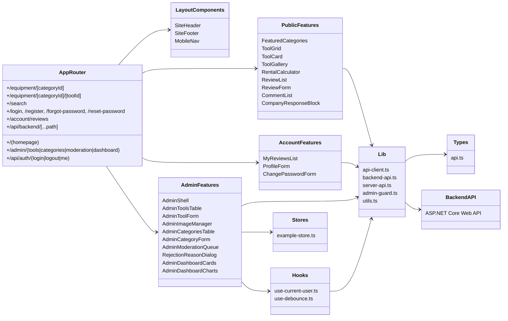

---

## 3. Activity Diagrams

### 3.1 Customer Review Submission Activity (Frontend Perspective)

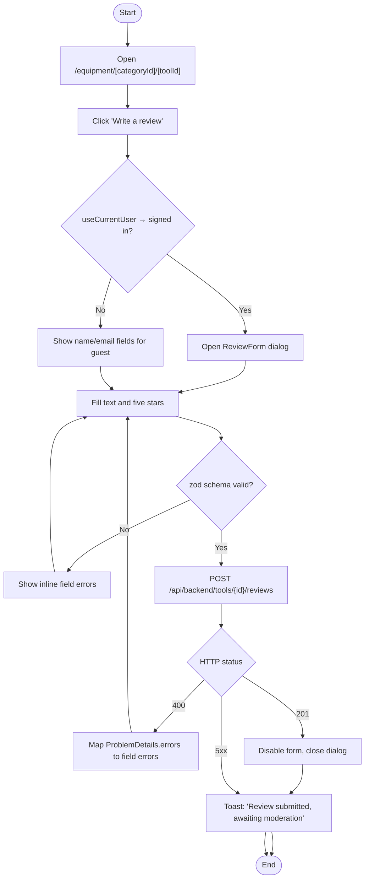

### 3.2 Admin Moderation Activity (Frontend Perspective)

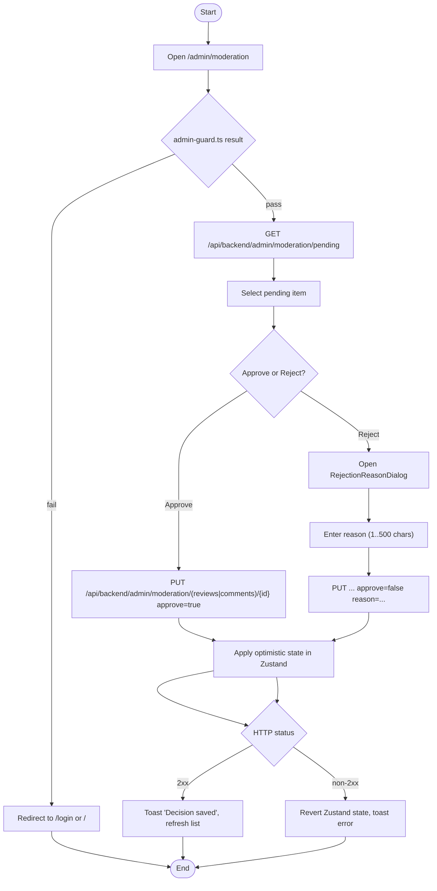

---

## 4. High-Level Frontend Architecture

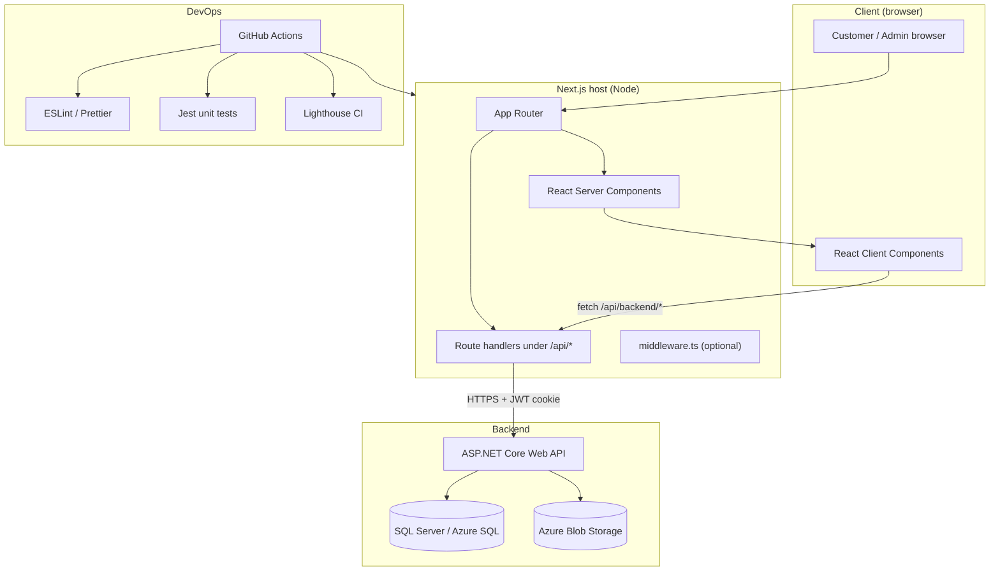

---

## 5. Sequence Diagrams

### 5.1 Customer Submits a Review

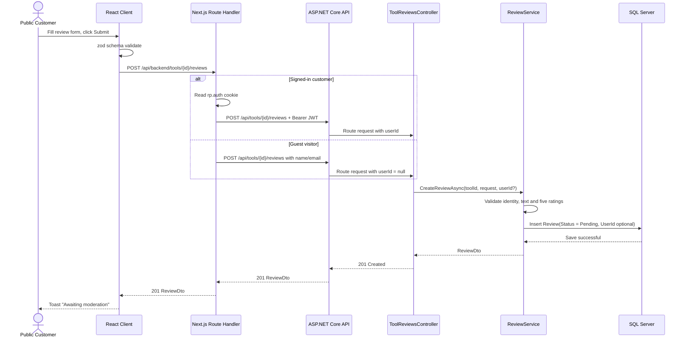

### 5.2 Admin Logs In and Opens the Moderation Queue

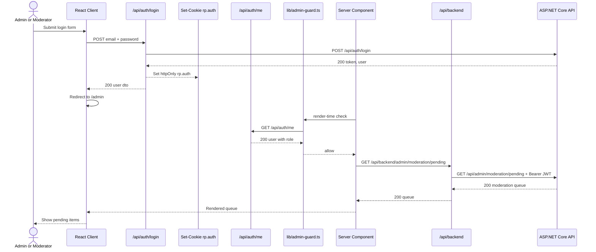

### 5.3 Public Catalogue Rendering

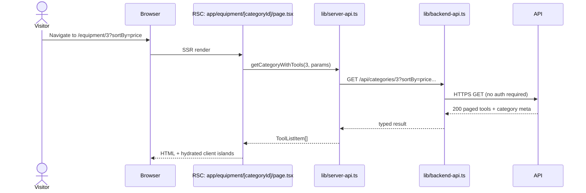

---

## 6. Data Flow Diagrams

### 6.1 Context-Level DFD

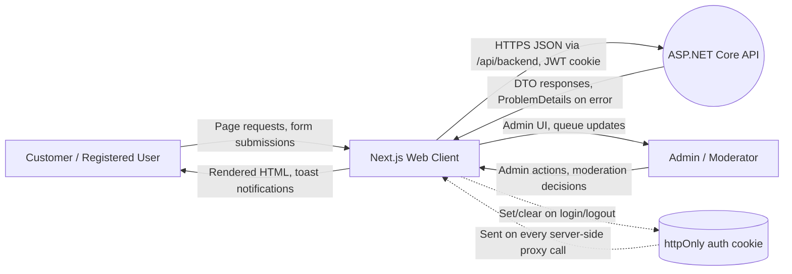

### 6.2 Level 1 DFD

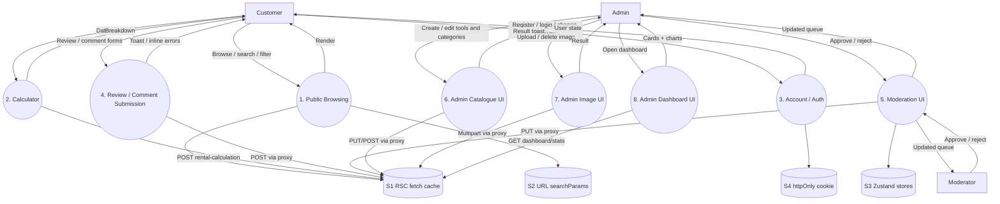

---

## 7. Routing Map

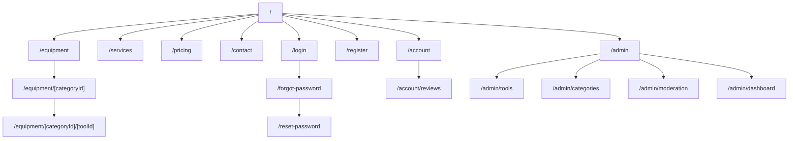

---

## 8. Design Traceability Summary

| Diagram | Supports |
|---------|----------|
| Use Case Diagram | Functional scope for Epic 1–3 from the frontend perspective |
| Component Diagram | App Router + feature components + lib modules + DTO types |
| Activity Diagrams | Review submission UX, moderation UX |
| High-Level Architecture | Browser, Next.js host, API, blob storage, CI |
| Sequence Diagrams | Review submission flow, admin login + moderation queue, public catalogue rendering |
| DFD Context and Level 1 | Actors, system boundary, frontend processes, transient data stores |
| Routing Map | URL surface of the App Router |
