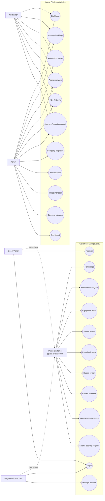

# Requirements Specification — Shelton Tool-Hire Review Portal (Web Client)

## 1. Introduction

### 1.1 Purpose

This document formally specifies the functional and non-functional requirements for the Next.js web client of the Shelton Tool-Hire Review Portal. It is the frontend companion to the backend [REQUIREMENTS-SPECIFICATION.md](../../ReviewPortal-API/docs/REQUIREMENTS-SPECIFICATION.md) and traces every user-facing screen and behaviour back to the same product brief.

### 1.2 Scope

The web client is a Next.js 15 App Router application written in React 19, TypeScript 5, and TailwindCSS 4. It renders the public catalogue, rental cost calculator, review and comment submission flows, customer account screens, and a separate back-office area for staff. All persistent data is owned by the ASP.NET Core Web API; this client is responsible for presentation, client-side validation, navigation, accessibility, and secure session handling.

### 1.3 Definitions and Abbreviations

| Term | Definition |
|------|-----------|
| App Router | Next.js 15 routing model used in [app/](../app/) |
| RSC | React Server Component — rendered on the server in the App Router |
| Client Component | A component marked with `"use client"` that runs in the browser |
| Server Action / Route Handler | Next.js server endpoint defined under [app/api](../app/api) |
| Backend API | The ASP.NET Core API at `NEXT_PUBLIC_API_URL` |
| Backend Proxy | Internal Next.js route at `/api/backend/*` that forwards calls and attaches the auth cookie |
| Auth Cookie | The httpOnly cookie set by `/api/auth/login` carrying the JWT |
| Admin Shell | The back-office layout in [components/admin](../components/admin) |
| Public Shell | The customer-facing layout in [components/layout](../components/layout) |
| Toast | A transient notification rendered through `sonner` |
| Form Schema | A `zod` schema used with React Hook Form to validate a user form |

---

## 2. Stakeholder Analysis

### 2.1 User Personas

The personas defined in the backend specification (Dave the DIY Customer, Sarah the Site Manager, Mark the Moderator) are the same end users of this web client. The frontend additionally has to satisfy:

#### Anya the Frontend Developer
- **Role:** Maintains UI components, page routes, and data fetching layers
- **Goals:** Add new pages or admin screens by composing existing primitives, keep types in sync with the API, ship accessible UI
- **Frustrations:** Components that drift from the design system, hidden client/server boundaries, type drift between the API and `types/api.ts`

#### Lena the QA Engineer
- **Role:** Runs the manual and automated test plans, drives Lighthouse and accessibility audits
- **Goals:** Reproduce flows quickly, get clear empty/error/loading states, run Jest and Playwright without setup friction

---

## 3. Functional Requirements

Each requirement maps to a user story in [agile/](agile/) and a backend requirement in the API's [REQUIREMENTS-SPECIFICATION.md](../../ReviewPortal-API/docs/REQUIREMENTS-SPECIFICATION.md).

### 3.1 Catalogue and Browsing (UI)

| ID | Requirement | Priority | User Story | Backend Ref |
|----|-------------|----------|------------|-------------|
| FE-01 | The homepage shall fetch and render all featured categories from `GET /api/categories/featured` with name and image | Must | US-1.1 | FR-01 |
| FE-02 | Category cards shall navigate to `/equipment/[categoryId]` and pre-fetch on hover | Must | US-1.1 | FR-02 |
| FE-03 | The category browsing page shall render a responsive grid of tools with thumbnail, name, starting price, and rating summary | Must | US-1.2 | FR-03 |
| FE-04 | The catalogue shall expose sort controls (name, price asc/desc, rating) bound to URL search params | Must | US-1.2 | FR-04 |
| FE-05 | The tool detail page shall render description, image gallery, three-tier rates, special notes, deposit info, and rating summary | Must | US-1.3 | FR-05, FR-06 |
| FE-06 | A site-wide search input shall be reachable from the header on every public page | Must | US-1.4 | FR-07 |
| FE-07 | Search and category pages shall debounce keystrokes by 300ms before issuing a backend request | Should | US-1.4 | FR-08 |
| FE-08 | The catalogue and search pages shall show a friendly empty state when the API returns zero results | Should | US-1.2, US-1.4 | FR-09 |
| FE-09 | The category page shall render a price range filter that pushes `minPrice` / `maxPrice` query params | Should | US-1.6 | FR-10 |
| FE-10 | List views shall render 12 items per page using server-driven pagination controls | Should | US-1.2 | FR-11 |

### 3.2 Rental Cost Calculator (UI)

| ID | Requirement | Priority | User Story | Backend Ref |
|----|-------------|----------|------------|-------------|
| FE-11 | The tool detail page shall render a rental calculator with start and end date-time pickers | Must | US-1.5 | FR-12, FR-13 |
| FE-12 | The calculator shall POST to `/api/tools/{id}/rental-calculation` and display the breakdown returned by the API | Must | US-1.5 | FR-14, FR-15 |
| FE-13 | The breakdown shall be rendered as a labelled list (tier × quantity × rate = subtotal) plus a final total | Must | US-1.5 | FR-16 |
| FE-14 | The form shall block submission when the end date-time is not strictly after the start date-time and shall surface an inline validation error | Must | US-1.5 | FR-17 |
| FE-15 | Date-time inputs shall be keyboard-operable and consume `react-day-picker` plus a time control | Should | US-1.5 | NFR-23 |

### 3.3 Reviews and Ratings (UI)

| ID | Requirement | Priority | User Story | Backend Ref |
|----|-------------|----------|------------|-------------|
| FE-16 | The tool detail page shall expose a "Write a Review" CTA that opens the review form | Must | US-2.1 | FR-18 |
| FE-17 | The review form shall render five star-rating inputs (Equipment, Customer Service, Technical Support, After-Sales, Value for Money) and a text area | Must | US-2.1 | FR-19 |
| FE-18 | The form shall block submission when any star rating is unselected or the text body is under 20 characters and shall surface inline errors per field | Must | US-2.1 | FR-20 |
| FE-19 | After submission, the UI shall show a "review pending moderation" confirmation and shall not display the review on the tool page until approved | Must | US-2.1 | FR-21 |
| FE-20 | The tool detail page shall list approved reviews newest first with reviewer name, star breakdown, average, and creation date | Must | US-2.2 | FR-22 |
| FE-21 | Listing and detail pages shall render the cached overall rating and review count | Must | US-2.3 | FR-23, FR-24 |
| FE-22 | Tools with fewer than 2 approved reviews shall render "Not enough reviews to rate" instead of a number | Should | US-2.3 | FR-26 |

### 3.4 Community Interaction (UI)

| ID | Requirement | Priority | User Story | Backend Ref |
|----|-------------|----------|------------|-------------|
| FE-23 | Approved reviews shall expose a "Comment" affordance and a comment form requiring name and ≥ 10 character text | Must | US-2.4 | FR-27, FR-28 |
| FE-24 | After submission, the UI shall show a "comment pending moderation" confirmation and shall not render the comment until approved | Must | US-2.4 | FR-29 |
| FE-25 | Staff users with role `Admin` or `Moderator` shall see a "Post company response" form on approved reviews that lack one | Must | US-2.5 | FR-30, FR-31 |
| FE-26 | Company responses shall appear immediately after submission with a visual distinction from customer content | Should | US-2.5 | FR-32 |

### 3.5 Authentication and Account (UI)

| ID | Requirement | Priority | User Story | Backend Ref |
|----|-------------|----------|------------|-------------|
| FE-27 | `/register` shall collect name, email, password, and password confirmation, validate them with a `zod` schema, and POST to `/api/auth/register` | Must | US-2.7 | FR-33 |
| FE-28 | `/login` shall POST to `/api/auth/login` and on success set the auth cookie via the Next.js route handler — the raw JWT shall never be exposed to client JS | Must | US-2.7 | FR-34 |
| FE-29 | `/account/reviews` shall render the signed-in user's reviews with status badges (Pending, Approved, Rejected) and the rejection reason where present | Should | US-2.8 | FR-35 |
| FE-30 | Unauthenticated users shall be able to browse and read everything but shall be redirected to `/login?next=...` when attempting protected actions | Must | US-2.7 | FR-36 |
| FE-31 | `/forgot-password` and `/reset-password` shall implement the token-based reset flow against the backend | Should | US-2.7 | FR-33 |

### 3.6 Back-Office UI

| ID | Requirement | Priority | User Story | Backend Ref |
|----|-------------|----------|------------|-------------|
| FE-32 | `/admin` shall be guarded by [lib/admin-guard.ts](../lib/admin-guard.ts); unauthenticated users get 401 → `/login`, customers get 403 → public home | Must | US-3.1 | FR-37 |
| FE-33 | The admin shell shall provide its own navigation (tools, categories, moderation, dashboard) visually distinct from the public site | Must | US-3.1 | NFR-17 |
| FE-34 | The admin tool form shall accept name, description, category, hourly/daily/weekly rates, special notes, deposit fields, and at least one image, and submit a multipart request to `POST /api/admin/tools` | Must | US-3.2 | FR-38, FR-46 |
| FE-35 | Admin edit screens shall PATCH/PUT to the corresponding admin endpoints and surface field-level validation errors returned by the API | Must | US-3.3 | FR-39 |
| FE-36 | The image manager shall support upload, reorder, and delete, and shall block deleting the last remaining image | Must | US-3.4 | FR-40, FR-47 |
| FE-37 | An "Activate / Deactivate" control shall call `PATCH /api/admin/tools/{id}/status` and reflect the new state without a full reload | Must | US-3.5 | FR-41 |
| FE-38 | The moderation queue shall render pending reviews and comments returned by `GET /api/admin/moderation/pending` with Approve and Reject buttons | Must | US-3.6 | FR-42 |
| FE-39 | Rejection shall require a reason captured in a modal before the PUT is issued | Must | US-3.6 | FR-43 |
| FE-40 | Category management screens shall allow create, rename, and delete, and shall surface the API's block-when-non-empty 409 response as an inline error | Should | US-3.7 | FR-44, FR-50 |
| FE-41 | The dashboard shall render the counts returned by `GET /api/admin/dashboard/stats` using Recharts where helpful | Could | US-3.8 | FR-45, FR-49 |

### 3.7 Cross-Cutting UI Requirements

| ID | Requirement | Priority | Backend Ref |
|----|-------------|----------|-------------|
| FE-42 | All forms shall use React Hook Form + zod resolvers and shall render inline error messages adjacent to the invalid field | Must | NFR-16 |
| FE-43 | Backend ProblemDetails responses shall be parsed and surfaced as toast messages, mapping `errors.<field>` to React Hook Form field errors where possible | Must | FR-51 |
| FE-44 | Every API call from the browser shall go through the [/api/backend](../app/api) proxy so the JWT remains in the httpOnly cookie | Must | NFR-06, NFR-12 |
| FE-45 | Loading, error, and empty states shall be implemented for every list and detail screen using the App Router's `loading.tsx` / `error.tsx` / inline fallbacks | Should | NFR-18 |
| FE-46 | Every interactive component shall be keyboard-operable and announced correctly to screen readers (use Radix primitives where available) | Must | NFR-21, NFR-23 |
| FE-47 | The public site shall be fully usable from 375px wide and shall scale gracefully to 1920px | Must | NFR-14 |

### 3.8 Requirements Traceability

This section traces the brief to backlog stories and UI requirements. The full backend traceability lives in [../../ReviewPortal-API/docs/REQUIREMENTS-SPECIFICATION.md §3.8](../../ReviewPortal-API/docs/REQUIREMENTS-SPECIFICATION.md).

| Brief Ref | Scenario Requirement | Backlog Stories | UI Requirements |
|-----------|----------------------|-----------------|-----------------|
| R2 | Browse the catalogue by category | US-1.1, US-1.2, US-1.6, US-3.7 | FE-01 to FE-04, FE-09, FE-10, FE-40 |
| R3 | Search the catalogue | US-1.4 | FE-06 to FE-08 |
| R4 | Submit reviews and support returning users | US-2.1, US-2.7, US-2.8 | FE-16 to FE-19, FE-27 to FE-31 |
| R5 | Provide a full tool/service detail page | US-1.3 | FE-05 |
| R6 | Accept hire dates and show a cost breakdown | US-1.5 | FE-11, FE-13, FE-14 |
| R7 | Cheapest combination from hourly, daily, and weekly rates | US-1.5 | FE-12 |
| R8 | Back-office access and admin operations | US-3.1, US-3.2, US-3.5, US-3.8 | FE-32 to FE-37, FE-41 |
| R9 | Edit equipment/service details and pricing | US-3.3 | FE-35 |
| R10 | Manage tool/service images | US-3.4 | FE-36 |
| R11 | Moderation queue with approval and rejection | US-3.6 | FE-38, FE-39 |
| R13-R17 | Five review rating categories | US-2.1 | FE-17, FE-18 |
| R18 | Comments on approved reviews | US-2.4 | FE-23, FE-24 |
| R19 | One official company response per review | US-2.5 | FE-25, FE-26 |
| R24 | Search across name, description, and category | US-1.4 | FE-06 |
| R25 | Aggregate, display, and sort by overall ratings | US-2.3 | FE-04, FE-21, FE-22 |
| R26 | Moderate customer content before publication | US-2.1, US-2.4, US-3.6 | FE-19, FE-24, FE-38, FE-39 |

---

## 4. Use Case Diagram

The web client supports the same actors as the backend. The diagram below shows the user-facing slice — see [FUNCTIONAL-DESIGN-DIAGRAMS.md](FUNCTIONAL-DESIGN-DIAGRAMS.md) for the full set.

---

## 5. Constraints and Assumptions

### 5.1 Constraints
- The client must be implemented in Next.js (App Router) per the module brief.
- The backend contract is owned by the API repository; the client must not introduce its own persistence.
- All secrets (JWT, API origins) are read from `NEXT_PUBLIC_*` and server-only env vars; nothing sensitive may be hard-coded.
- The client must build on Node.js 18.17+ to match Next.js 15.

### 5.2 Assumptions
- The API exposes the routes documented in [agile/IMPLEMENTATION-SEQUENCE.md](agile/IMPLEMENTATION-SEQUENCE.md).
- Images served by the API are hosted on Azure Blob Storage and the URLs returned are stable.
- Production traffic is served over HTTPS — CORS is enforced server-side, not in the browser.
- Internationalisation is out of scope.

---

## 6. Functional Completion and Gap Status

### 6.1 Coverage Summary

| Area | UI Requirement IDs | Status | Evidence |
|------|--------------------|--------|----------|
| Catalogue and browsing | FE-01 to FE-10 | Implemented under [app/equipment](../app/equipment) and [components/equipment](../components/equipment) | Jest tests in `__tests__` next to components |
| Rental calculator | FE-11 to FE-15 | Implemented on the tool detail page | Jest unit tests for the form and inline schema |
| Reviews and ratings | FE-16 to FE-22 | Implemented under [components/feed](../components/feed) and the tool detail page | Jest tests cover validation paths |
| Community interaction | FE-23 to FE-26 | Implemented in the review feed | Jest tests cover staff-only branch |
| Authentication and account | FE-27 to FE-31 | Implemented under [app/login](../app/login), [app/register](../app/register), [app/account](../app/account) | Jest tests for forms; manual smoke test for cookie flow |
| Back-office | FE-32 to FE-41 | Implemented under [app/admin](../app/admin) and [components/admin](../components/admin) | Manual screenshots + Jest tests |
| Cross-cutting | FE-42 to FE-47 | Implemented via shared form helpers and Tailwind responsive utilities | Lighthouse + axe-core spot checks |

### 6.2 Completion Gate Summary

| Gate | Status | Action Before Final Sign-Off |
|------|--------|------------------------------|
| Build and unit tests | `npm run build` and `npm test` pass on clean checkout | Keep `prebuild` hook running `test:ci` |
| Lighthouse audit | Pending capture | Run on production build and store under [submission evidence](SUBMISSION-GAP-CHECKLIST.md) |
| Accessibility audit | Pending capture | Run axe-core on each top-level route |
| API contract | In sync with backend `IMPLEMENTATION-SEQUENCE.md` | Update `types/api.ts` whenever the API ships changes |
| Deployment readiness | Documented in [DEPLOYMENT.md](DEPLOYMENT.md) | Verify environment variables on the chosen host |
