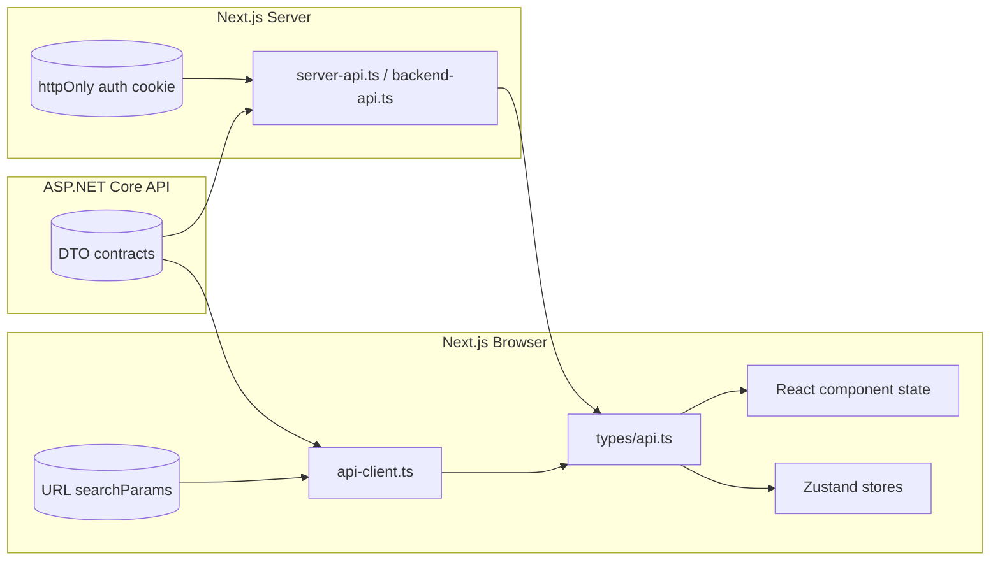

# State & Data Model — Shelton Tool-Hire Review Portal (Web Client)

> Purpose: MSc submission data model artefact for the Next.js web client.
>
> This is the frontend counterpart to the API's [ERD.md](../../ReviewPortal-API/docs/ERD.md). Where the backend describes relational tables, this document describes the data that lives in the client: API DTOs consumed by components, URL state, cookies, and client-only state in Zustand stores and React state.

---

## 1. Overview

The client owns no persistent data — every domain entity is loaded from the API. The client is responsible for:

1. The **read model** of the API as TypeScript types in [types/api.ts](../types/api.ts).
2. The **session** state held in an httpOnly cookie and surfaced via `/api/auth/me`.
3. The **URL state** for sort, filter, search, and pagination.
4. **Ephemeral UI state** for forms, dialogs, optimistic updates.

The diagram below summarises the relationship between these layers and the API. See the API's [ERD.md](../../ReviewPortal-API/docs/ERD.md) for the database-level entity diagram.



---

## 2. API Read Model (`types/api.ts`)

The types below mirror the C# DTOs returned by the API. Field names use camelCase because Next.js serialises with the default JSON casing.

### 2.1 Catalogue

```ts
export interface Category {
  id: number;
  name: string;
  description?: string;
  imageUrl?: string;
  toolCount?: number;
}

export interface ToolListItem {
  id: number;
  categoryId: number;
  name: string;
  thumbnailUrl?: string;
  hourlyRate: number;
  dailyRate: number;
  weeklyRate: number;
  overallRating: number | null;
  reviewCount: number;
  hasEnoughReviews: boolean;
  isActive: boolean;
}

export interface ToolDetail extends ToolListItem {
  description: string;
  images: ToolImage[];
  specialNotes?: string;
  depositRequired: boolean;
  depositAmount?: number;
  categoryName: string;
}

export interface ToolImage {
  id: number;
  imageUrl: string;
  displayOrder: number;
}

export interface RentalCalculation {
  startUtc: string;
  endUtc: string;
  totalCost: number;
  breakdown: RentalLineItem[];
}

export interface RentalLineItem {
  tier: 'Hourly' | 'Daily' | 'Weekly';
  quantity: number;
  rate: number;
  subtotal: number;
}
```

### 2.2 Reviews and Community

```ts
export type ReviewStatus = 'Pending' | 'Approved' | 'Rejected';

export interface Review {
  id: number;
  toolId: number;
  reviewerName: string;
  reviewText: string;
  equipmentRating: number;
  customerServiceRating: number;
  technicalSupportRating: number;
  afterSalesRating: number;
  valueForMoneyRating: number;
  overallRating: number;
  status: ReviewStatus;
  rejectionReason?: string;
  createdDate: string;
  companyResponse?: CompanyResponse;
}

export interface Comment {
  id: number;
  reviewId: number;
  commenterName: string;
  commentText: string;
  status: ReviewStatus;
  createdDate: string;
}

export interface CompanyResponse {
  id: number;
  reviewId: number;
  staffName: string;
  responseText: string;
  createdDate: string;
  updatedDate: string;
}
```

### 2.3 Authentication and Account

```ts
export type UserRole = 'Customer' | 'Admin' | 'Moderator';

export interface User {
  id: number;
  name: string;
  email: string;
  role: UserRole;
}

export interface AuthResponse {
  user: User;
  expiresAtUtc: string;
}

export interface MyReviewSummary {
  id: number;
  toolId: number;
  toolName: string;
  overallRating: number;
  status: ReviewStatus;
  rejectionReason?: string;
  createdDate: string;
}
```

### 2.4 Admin

```ts
export interface AdminToolListItem {
  id: number;
  name: string;
  categoryId: number;
  categoryName: string;
  isActive: boolean;
  imageCount: number;
  overallRating: number | null;
  reviewCount: number;
}

export interface AdminToolDetail extends AdminToolListItem {
  description: string;
  hourlyRate: number;
  dailyRate: number;
  weeklyRate: number;
  specialNotes?: string;
  depositRequired: boolean;
  depositAmount?: number;
  images: ToolImage[];
}

export interface ModerationItem {
  kind: 'Review' | 'Comment';
  id: number;
  toolName?: string;
  reviewerName: string;
  body: string;
  createdDate: string;
}

export interface DashboardStats {
  activeToolCount: number;
  inactiveToolCount: number;
  pendingReviewCount: number;
  pendingCommentCount: number;
  reviewsThisMonth: number;
  topRatedTools: AdminToolListItem[];
  mostReviewedTools: AdminToolListItem[];
}
```

### 2.5 Errors

```ts
export interface ProblemDetails {
  type?: string;
  title: string;
  status: number;
  detail?: string;
  instance?: string;
  errors?: Record<string, string[]>;
  requestId?: string;
}
```

---

## 3. Form Schemas (`zod`)

Each form has a `zod` schema co-located with the component. The table below records the validation rules that mirror the backend's FluentValidation.

| Form | Schema rules | Mirrors backend |
|------|--------------|-----------------|
| Register | name 1–100, email valid, password ≥ 8 with upper + digit, confirm matches | `RegisterRequestValidator` |
| Login | email valid, password non-empty | `LoginRequestValidator` |
| Forgot password | email valid | `ForgotPasswordRequestValidator` |
| Reset password | token non-empty, password ≥ 8 with upper + digit | `ResetPasswordRequestValidator` |
| Review form | five ratings 1–5, text ≥ 20, ≤ 2000; name 1–100, email valid (guest) | `CreateReviewRequestValidator` |
| Comment form | name 1–100, text ≥ 10, ≤ 1000 | `CreateCommentRequestValidator` |
| Company response form | text 1–2000 | `CreateCompanyResponseRequestValidator` |
| Rental calculator | startUtc/endUtc valid ISO; end > start | `RentalCalculationRequestValidator` |
| Admin tool form | name 1–200, description 1–2000, categoryId positive, hourly/daily/weekly > 0, first image present on create, image ≤ 5MB JPG/PNG/WebP | `CreateToolRequestValidator`, `UpdateToolRequestValidator` |
| Admin category form | name 1–100 unique, description ≤ 500 | `CreateCategoryRequestValidator` |
| Rejection reason | reason 1–500 | `ModerateReviewRequestValidator` |

When the API returns a 400 with a `errors` map, the form helper surfaces each entry through `setError(field, { message: messages[0] })` so the user sees the same message inline.

---

## 4. URL State

Filterable list pages read state from `searchParams` so links are shareable and back/forward navigation works correctly.

| Page | Param | Notes |
|------|-------|-------|
| `/equipment/[categoryId]` | `page` | Defaults to 1; bound to pagination component |
| `/equipment/[categoryId]` | `sortBy` | `name` / `price` / `rating` |
| `/equipment/[categoryId]` | `sortOrder` | `asc` / `desc` |
| `/equipment/[categoryId]` | `minPrice`, `maxPrice` | Bound to the price filter |
| `/equipment` (search) | `q` | Bound to the header search input |
| `/admin/moderation` | `status` | Defaults to `Pending` |

Components update params with `router.replace(`${pathname}?${params.toString()}`, { scroll: false })` to avoid full reloads.

---

## 5. Cookies

| Cookie | Where set | Where read | Purpose |
|--------|-----------|------------|---------|
| `rp.auth` | `/api/auth/login` route handler | `lib/backend-api.ts` (server) | Carries the JWT |
| Attributes | `httpOnly; Secure; SameSite=Lax; Path=/; Max-Age=3600` | — | Matches backend `Jwt__ExpiryMinutes=60` |

No other cookie is used for state. Theme and similar preferences are local-storage only.

---

## 6. Zustand Stores

Client-only stores hold ephemeral UI state. They reset on full page reload.

| Store | File | Shape |
|-------|------|-------|
| Example UI store | [store/example-store.ts](../store/example-store.ts) | Pattern + reference implementation for future feature stores |

When a real feature needs a store (e.g. an admin moderation optimistic queue), follow the same pattern:

```ts
interface ModerationStore {
  optimisticDecisions: Record<number, 'Approved' | 'Rejected'>;
  decide: (id: number, decision: 'Approved' | 'Rejected') => void;
  reset: () => void;
}
```

Reconcile every store with the authoritative server response on the next render.

---

## 7. React Hooks

| Hook | Purpose |
|------|---------|
| [hooks/use-current-user.ts](../hooks/use-current-user.ts) | Hydrates the signed-in user from `/api/auth/me`. Returns `{ user, loading, refresh }` |
| [hooks/use-debounce.ts](../hooks/use-debounce.ts) | Generic debounce for search inputs |

---

## 8. Data Flow Summary

| Read flow | How |
|-----------|-----|
| Public catalogue page | Server Component calls `lib/server-api.ts` → `lib/backend-api.ts` → upstream API |
| Auth-aware client | Client Component calls `useCurrentUser` → `/api/auth/me` |
| Admin guarded page | Page renders → `lib/admin-guard.ts` → `/api/auth/me` → render or redirect |

| Write flow | How |
|------------|-----|
| Review submission | Client form → `lib/api-client.ts` → `/api/backend/tools/{id}/reviews` proxy → upstream API. Server returns ProblemDetails on failure |
| Image upload | Client form (multipart) → `/api/backend/admin/tools/{id}/images` proxy. Body forwarded verbatim, cookie attached |
| Admin moderation | Optimistic Zustand update → `lib/api-client.ts` → proxy. On failure, reset from latest server response |

---

## 9. Consistency Rules

- Every shape on the wire must have a corresponding type in `types/api.ts`.
- Components must never inline ad-hoc API types.
- Stores must reconcile after each request — no long-lived divergence between the server truth and client state.
- Form schemas must keep parity with the backend validators; when the API tightens a rule, the matching zod schema is updated in the same PR.
