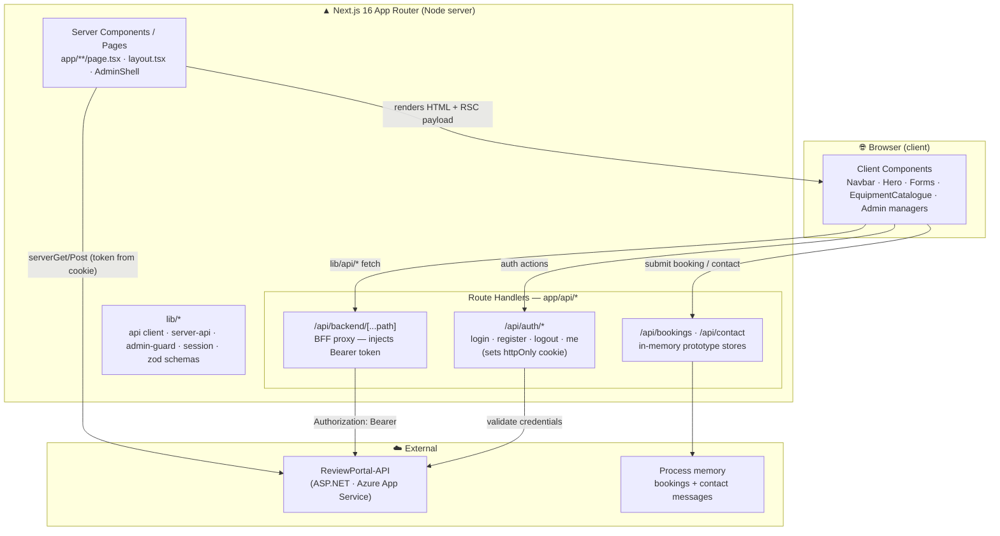
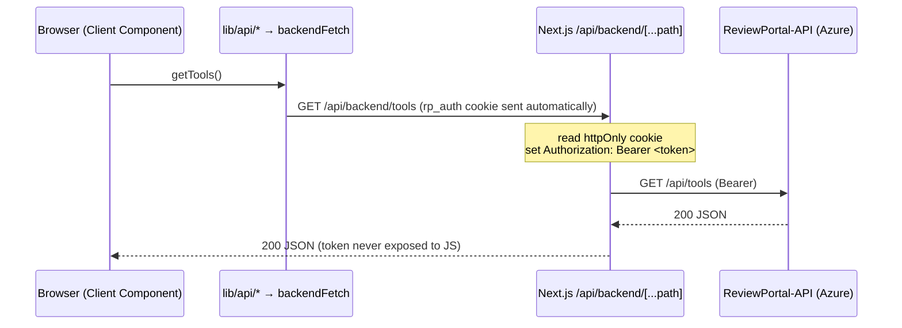

# Frontend Architecture — Shelton Tool-Hire (Review Portal Web)

> A reference for the viva. Diagrams are written in **Mermaid** so they render
> directly on GitHub, in VS Code (Mermaid preview), or at https://mermaid.live.
> See [How to render / export](#12-how-to-render--export-the-diagrams) to turn
> any diagram into an image for slides.

---

## 1. Overview

The frontend is a **Next.js (App Router) application** that serves the public
tool-hire website, the customer account area, and the staff admin console. It
does **not** talk to the database directly — it calls an external
**ReviewPortal-API** (ASP.NET, hosted on Azure App Service). Next.js sits in the
middle as a **Backend-for-Frontend (BFF)**: it renders pages, exposes a thin set
of API routes, and proxies authenticated calls to the backend while keeping the
auth token out of the browser's JavaScript.

---

## 2. Technology stack

| Concern | Choice |
|---|---|
| Framework | **Next.js 16** (App Router) + Turbopack |
| UI library | **React 19** (Server + Client Components) |
| Language | **TypeScript 5** |
| Styling | **Tailwind CSS 4** (theme tokens in `app/globals.css`) |
| UI primitives | Radix UI + local shadcn-style components (`components/ui/*`) |
| Icons | lucide-react |
| Forms & validation | react-hook-form + **Zod** (`lib/form-schemas.ts`) |
| Toasts | sonner |
| Testing | Jest + React Testing Library |
| Hosting / CI | Azure App Service via GitHub Actions |

---

## 3. High-level architecture



**Reading it:** the browser never calls the backend directly and never holds the
JWT. Client components call typed functions in `lib/api/*`, which hit the
`/api/backend/[...path]` proxy; the proxy reads the `rp_auth` httpOnly cookie and
forwards the request to the real API with an `Authorization: Bearer` header.
Server Components fetch server-to-server through `lib/server-api.ts`.

---

## 4. Rendering model — Server vs Client Components

The App Router renders **Server Components by default** (no JS shipped) and
opts specific components into the client with `"use client"`.

| Server Components (default) | Client Components (`"use client"`) |
|---|---|
| Page shells: `app/equipment/page.tsx`, `app/services`, `app/about`, admin pages | Interactive UI: `Navbar`, `Footer`, `Hero` |
| Metadata / SEO (`export const metadata`) | Stateful lists: `EquipmentCatalogue`, `BookingsManager`, `ContactsManager` |
| Route guards (`requireStaffUser`) run before render | Forms: contact, login, register, password reset |
| Direct server-to-server data fetch (`server-api`) | Anything using hooks, events, `fetch` to `/api/*` |

`app/layout.tsx` is the root shell: `Navbar` → `main` → `Footer` → `Toaster`.
Admin pages additionally wrap content in `AdminShell` (console header + tab nav).

---

## 5. Routing map (file-based)

```
/                      Home (Hero, Categories, Featured, Testimonials, CTA)
/equipment             Catalogue (search + category filter via URL params)
/equipment/[id]        Tool detail + per-product rental calculator + reviews
/reviews               Public reviews
/pricing /services     Marketing pages
/about /faq /help      Info pages
/terms /privacy        Legal stubs (content pending, noindex)
/contact               Public contact form  ─┐
/login /register                             │ POST
/forgot-password /reset-password             │
/account/reviews                             │
/account/change-password                     │
/admin                 Dashboard (Admin)     │
/admin/moderation      Review moderation     │
/admin/bookings        Booking requests      │
/admin/contacts        Contact messages  ◀───┘  (new)
/admin/tools           Manage tools (Admin)
/admin/categories      Manage categories (Admin)
```

---

## 6. Data & API layer — the BFF proxy

Two distinct data paths, both targeting the same external API:

**A. Client-side reads/writes (via the proxy):**



**B. Login (token is set server-side as an httpOnly cookie):**

```mermaid
sequenceDiagram
  participant B as Browser
  participant N as /api/auth/login
  participant A as ReviewPortal-API

  B->>N: POST { email, password }
  N->>A: POST /api/auth/login
  A-->>N: JWT
  Note over N: Set-Cookie rp_auth (httpOnly, secure)
  N-->>B: 200  (cookie set; JWT is NOT readable from JS)
  B->>B: dispatch "auth:changed" → Navbar re-fetches /api/auth/me
```

Server Components and route guards use `lib/server-api.ts`
(`serverGet/serverPost/...`) to call the backend **directly** (server-to-server),
attaching the token read from the cookie — no proxy hop needed on the server.

---

## 7. Authentication & authorization

- **Token storage:** JWT lives in an **httpOnly, secure cookie** (`rp_auth`),
  set by `/api/auth/*`. It is never placed in `localStorage` or exposed to
  client JS → mitigates XSS token theft.
- **Token attachment:** added as `Authorization: Bearer` *on the server* — by the
  `/api/backend` proxy (client calls) or by `server-api` (server calls).
- **Route protection** (`lib/admin-guard.ts`, run inside Server Components):
  - `requireAuthenticatedUser()` — any logged-in user
  - `requireStaffUser()` — Admin **or** Moderator (admin console, incl. Messages)
  - `requireAdminUser()` — Admin only (tools, categories, dashboard)
  - Unauthorized requests `redirect()` to `/login?next=…` or away from the page.
- **Role-aware UI:** `Navbar` and `AdminShell` show/hide links by role; the
  API routes independently re-check (`isStaff`) — the UI is not the security
  boundary.

---

## 8. State management & UI system

- **No global store** (no Redux/Zustand). State is local React state + hooks.
- **URL as state:** catalogue search/category live in query params
  (`useSearchParams`), so links and the homepage search are shareable and
  deep-linkable.
- **Cross-component signal:** a `window` `"auth:changed"` event tells the Navbar
  to re-fetch the session after login/logout.
- **UI system:** Tailwind utility classes + a small set of reusable primitives
  in `components/ui/*` (Button, Badge, Dialog, Select, Spinner, Toaster) built on
  Radix; design tokens (colors, `--nav-offset`) centralised in `globals.css`.

---

## 9. Directory structure

```
Review-Portal-Web/
├── app/                      # Routes (App Router)
│   ├── layout.tsx            # Root shell: Navbar + main + Footer + Toaster
│   ├── page.tsx              # Home
│   ├── (public routes…)/     # equipment, reviews, pricing, about, faq, …
│   ├── account/ · admin/     # Authenticated & staff areas
│   └── api/                  # Route Handlers (BFF)
│       ├── auth/*            # login, register, logout, me  (cookie auth)
│       ├── backend/[...path] # generic proxy → ReviewPortal-API
│       ├── bookings/ · contact/  # in-memory prototype endpoints
├── components/
│   ├── layout/               # Navbar, Footer
│   ├── sections/             # Home sections (Hero, Categories, CTA, …)
│   ├── equipment/            # Catalogue, detail, review widgets
│   ├── admin/                # AdminShell, BookingsManager, ContactsManager, …
│   ├── account/              # My reviews, etc.
│   └── ui/                   # Reusable primitives (Button, Badge, Spinner…)
├── lib/
│   ├── api/                  # Client API modules (auth, tools, reviews, …)
│   │   └── _client.ts        # backendFetch → /api/backend proxy
│   ├── server-api.ts         # Server-to-server fetch (+ AUTH_COOKIE_NAME)
│   ├── admin-guard.ts        # Server-side route guards
│   ├── session.ts            # getSessionUser / isStaff
│   ├── bookings-store.ts     # In-memory store (prototype)
│   ├── contact-store.ts      # In-memory store (prototype)
│   └── form-schemas.ts       # Zod schemas
├── types/                    # Shared TypeScript types
└── .github/workflows/        # CI: tests, ci-cd, security, QA trigger
```

---

## 10. Build, test & CI

- **Build:** `next build` (Turbopack). `prebuild` runs the Jest suite, so a
  build can't pass with failing tests.
- **Unit tests:** Jest + React Testing Library (jsdom), via `next/jest`.
- **GitHub Actions:** `tests.yml` (lint + typecheck + Jest + coverage),
  `ci-cd.yml` (lint + build + deploy to Azure on `main`), `security.yml`
  (npm audit + CodeQL + Gitleaks), plus a workflow that triggers a separate
  Playwright E2E repo. Dependabot keeps deps current.

---

## 11. Key design decisions (viva talking points)

1. **BFF proxy (`/api/backend/[...path]`)** — one place to attach auth, hide the
   backend origin, and avoid CORS. The browser only ever talks to its own origin.
2. **httpOnly cookie auth** — the JWT is unreadable from JavaScript, so an XSS
   bug can't steal the session token. Token is attached server-side only.
3. **Server Components first** — pages render on the server with no client JS by
   default; only interactive widgets opt into `"use client"`, keeping bundles
   small and improving first load.
4. **Guards in Server Components, re-checked in API routes** — authorization is
   enforced on the server on both the render path and the data path; the UI
   merely reflects it.
5. **URL-driven catalogue state** — search/filter live in the URL, making
   results shareable and the back button predictable.
6. **In-memory stores are deliberate prototype scope** — bookings and contact
   messages persist in process memory because the backend has no endpoint for
   them yet; the seams (`*-store.ts` + route handlers) are isolated so swapping
   in a real backend table is a localised change.
7. **Typed, layered API access** — UI never calls `fetch` to the backend
   directly; it goes through typed domain functions in `lib/api/*`, which is
   easy to mock in tests and refactor.

---

## 12. How to render / export the diagrams

- **GitHub / VS Code:** open this file — Mermaid blocks render automatically
  (VS Code may need the “Markdown Preview Mermaid Support” extension).
- **For slides (PNG/SVG):** paste a diagram into https://mermaid.live → *Actions
  → Download PNG/SVG*.
- **CLI:** `npx @mermaid-js/mermaid-cli -i docs/frontend-architecture.md -o arch.png`
